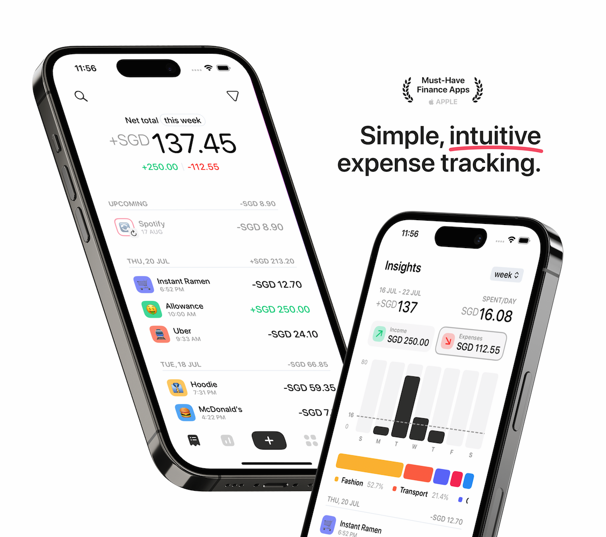
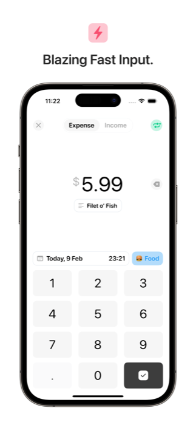
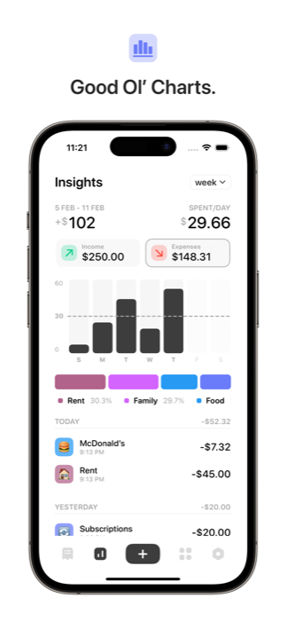
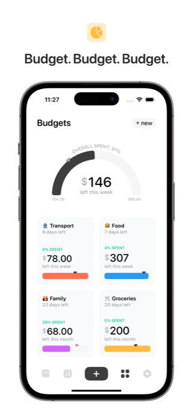
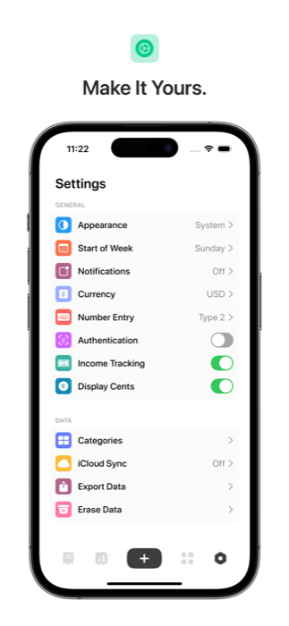
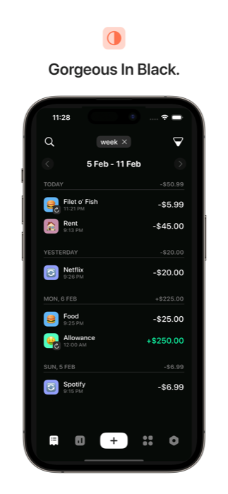
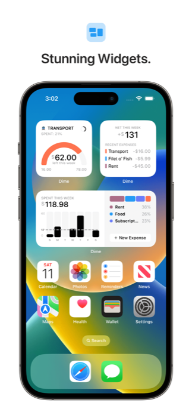
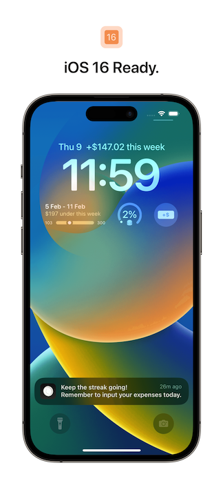

# Zakatly

<p align="center">
  
</p>

Zakatly is a finance app that puts Zakat at the heart of your financial planning. By centering your financial management around your Zakat obligations, Zakatly helps you maintain a balance between wealth growth and Islamic charitable duties. Track your Nisab thresholds, calculate Zakat on different types of assets, and manage your regular expenses - all while ensuring you're meeting your religious obligations. Built with iOS design guidelines in mind, it provides a seamless experience for Muslims seeking to align their financial decisions with Islamic principles.

## App Preview

<p align="center">
   
   
  
  
</p>
<p align="center">
  
  
  
</p>

## Why You'll Love Zakatly

- Automatic Zakat calculations based on your assets and investments
- Real-time tracking of your Nisab threshold status
- Islamic year-end projections for Zakat obligations
- Dynamic dashboards showing your projected Zakat due by the end of the Hijri year
- Smart budgeting that considers your Zakat obligations when planning expenses
- Categorize wealth by asset type (gold, silver, cash, investments, business assets)
- Track multiple currencies with accurate Zakat thresholds for each
- Automated reminders for Zakat due dates based on your Islamic calendar
- Built-in guides for Zakat calculation methods and rules
- Beautifully iOS-centric design, with simplicity at its core
- Sync your data securely across all your iOS devices via iCloud
- Biometric authentication to protect your sensitive financial data
- Elegant dark mode for comfortable night-time use
- Informative widgets to keep track of your Zakat obligations at a glance

## Project Structure

### App Organization

- `/app` - Main application directory
  - `/BudgetIntent` - Budget-related app intents for Siri and Shortcuts integration
  - `/BudgetIntentUI` - User interface components for budget intents
  - `/dime` - Core application code
    - `/Assets.xcassets` - Asset catalog containing:
      - App icons and their variants
      - Category colors for transaction categorization
      - UI colors for theming and styling
      - Gradient colors for visual elements
      - Icons for UI elements
      - Import-specific colors
      - Percentage-based indicator colors
      - Settings-related colors
      - Tab bar icons
    - `/Components` - Reusable UI components
      - `/Buttons` - Custom button implementations
      - `/Toolbar` - Toolbar-related components
      - `/Transactions` - Transaction-specific UI components
    - `/Data` - Data layer including Core Data model
    - `/Models` - Business logic and data models
    - `/Utilities` - Helper functions and utility classes
    - `/Views` - Main application views
      - `/Settings` - Settings screens and related views
      - `/Shapes` - Custom shape components

- `/ExpenditureWidget` - Widget extension for iOS home screen
  - Contains widget-specific assets and localizations

- `/Localizations` - Language support files
  - Currently supports English (en), French (fr), and Russian (ru)

### Supporting Directories

- `/.github` - GitHub-specific files and issue templates
- `/docs` - Documentation and assets for the repository
- `/Zakatly.xcodeproj` - Xcode project configuration

The app follows a modular architecture with clear separation of concerns:
- UI components are isolated in the Components directory
- Business logic is contained within Models
- Data persistence is handled through Core Data
- Localization is maintained separately for easy translation management
- Assets are organized by function and type in the asset catalog

## How to help

- For feature requests, bug reports, or suggestions about Zakat calculations, please reach out through our support channels
- To stay updated on new features and improvements, follow us on social media
- For questions about Zakat calculations or Islamic finance features, consult our in-app guide or contact our support team

## How to build

### Required

- Xcode 14.0 or later
- iOS 16.0 or later
- Active Apple Developer account

### Development Setup

1. Request access to the development repository
2. Clone the project:
   ```bash
   git clone [repository-url]
   ```
3. Open `Zakatly.xcodeproj` in Xcode
4. Install dependencies through Swift Package Manager:
   - Navigate to `File > Packages > Resolve Package Versions`
5. Build and run the project

## Third party dependencies

- [Alamofire](https://github.com/Alamofire/Alamofire) - Network requests for currency and gold prices
- [CloudKitSyncMonitor](https://github.com/ggruen/CloudKitSyncMonitor) - iCloud sync monitoring
- [ConfettiSwiftUI](https://github.com/simibac/ConfettiSwiftUI) - Celebration animations
- [SwiftUI Introspect](https://github.com/siteline/swiftui-introspect) - UI customization
- [IsScrolling](https://github.com/fatbobman/IsScrolling) - Scroll detection
- [Popovers](https://github.com/aheze/Popovers/) - Custom popover menus

## Privacy & Security

Zakatly takes the privacy of your financial data seriously. All calculations are performed locally on your device, and your data is only synchronized through your personal iCloud account. We do not collect or store any personal financial information on our servers.

## Support

For support, feature requests, or questions about Zakat calculations:
- Visit our website: [website-url]
- Email us: [support-email]
- In-app support section

## Legal

Copyright © 2025 Zakatly. All rights reserved.
